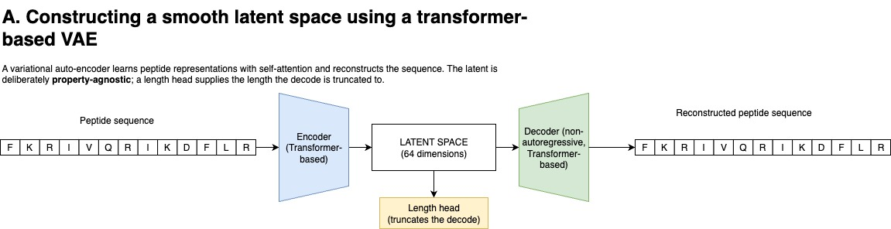
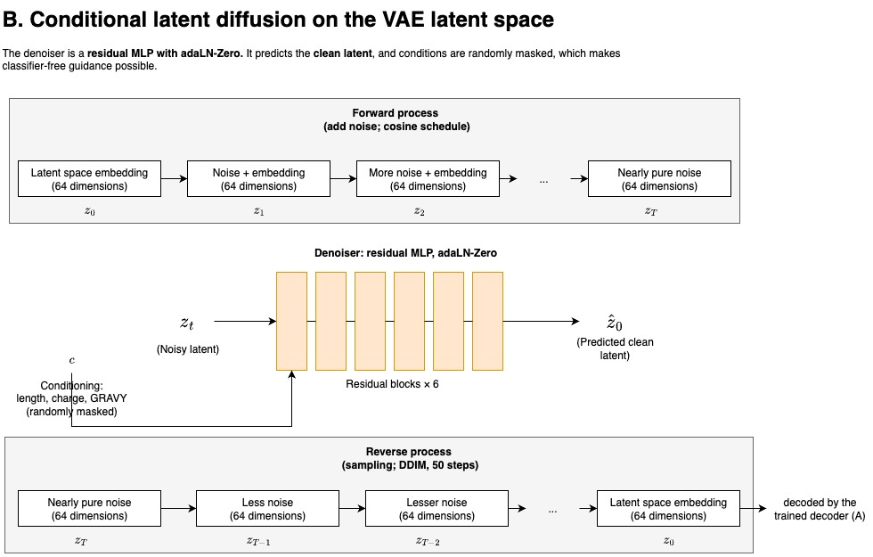
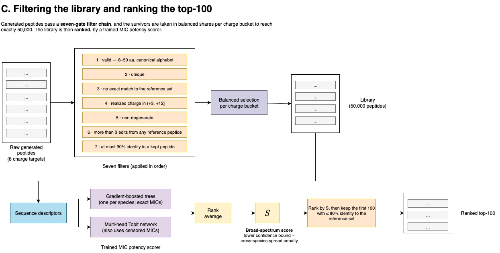

# A Three-Stage Generative Pipeline for Antimicrobial Peptide Design: Latent Diffusion over a Property-Agnostic VAE, with a Censoring-Aware Potency Ranker

**Submission to AMP Challenge 2027 | Hazra Group**

*Siddhant Poudyal†¹, Gautam Ahuja†², Chetana Baliga³, Aurosikha Das³, Saugata Hazra‡¹, Rik Ganguly‡³**

† Equal contribution (co-first authors)
‡ Corresponding authors (co-corresponding authors)

**Affiliations**

¹ Department of Biosciences and Bioengineering, Indian Institute of Technology Roorkee, Roorkee, Uttarakhand, India<br/>
² Ashoka University, Sonipat, Haryana, India<br/>
³ Department of Biotechnology, Faculty of Natural Sciences, Ramaiah University of Applied Sciences, Gnanagangothri Campus, New BEL Road, MSR Nagar, Bengaluru–560054, Karnataka, India<br/>

Code: [PUBLIC REPO URL](https://github.com/siddhantp2807/amp-challenge-2027) | License: BSD-3 | Contact: siddhantp457@gmail.com | Team name: Hazra Group

---

## Abstract

We built a three-stage pipeline for designing antimicrobial peptides (AMPs). A variational autoencoder (VAE) learns a compact latent space of peptides. A conditional latent diffusion model samples new points in that space, steered by length, net charge and hydrophobicity (GRAVY). A regressor trained on minimum inhibitory concentration (MIC) data then ranks the survivors of a seven-gate filter chain to produce the top-100 list. From $160,000$ raw samples, $57,782$ passed all gates and $50,000$ were kept for the library. The ranker reaches a spearman correlation of $0.518$ on a held-out test set and a concordance of $0.718$. Everything reported here is retrospective on public data, and nothing has been tested in the lab.

---

## 1. Overview

We applied an approach where we used a generator and the biological properties as conditioning and ranking. During the training, the variational autoencoder (VAE) never sees the peptide properties. The added diffusion model receives them only as optional conditions. The ranker for the Minimal Inhibitory Concentration (MIC) values is a separate model. This allows for a modular and flexible design to choose the candidates without retraining the generator.

---

## 2. Training Data

We used four public sources: DBAASP ($25,069$ peptides), GRAMPA ($6,760$), and DRAMP together with MarlysAMP ($103,200$ combined).

We prepared two corpus with different levels of strictness.

- **Fine-tuning corpus (strict).** Monomers only, the 20 standard amino acids, 8 to 50 residues, no `N-` or `C-` terminal modifications, and no intra-chain bonds such as disulfides. This leaves $8,455$ peptides.
- **Pre-training corpus (loose).** Sampled from MarlysAMP, which has no modification annotations, so only the length and disulfide filters can be applied. It is larger but noisier: $34,937$ peptides.

**Avoiding homology leakage.** We clustered both corpus with CD-HIT at $50\%$ identity and assigned the $90/5/5$ split at the cluster level, so no cluster is ever divided. The fine-tuning split is $7,609$ train / $423$ validation / $423$ test. We then removed any pre-training peptide whose cluster overlapped the fine-tuning validation or test set, which brought the pre-training corpus from $34,937$ down to $28,091$.

**MIC labels for the ranker.** $6,509$ MIC measurements covering $2,342$ peptides and $6$ bacterial species (*E. coli*, *S. aureus*, *P. aeruginosa*, *K. pneumoniae*, *A. baumannii*, *E. faecalis*), restricted to a single growth medium (MHB) so that assays are comparable. 
> **For detailed data documentation, see [docs/DATA.md](docs/DATA.md)** <br/>
> **For detailed usage documentation, see [docs/USAGE.md](docs/USAGE.md)**

---

## 3. Method

### 3.1 Stage 1: Property-agnostic VAE

A transformer encoder maps each peptide to a 64-dimensional latent vector. A non-autoregressive decoder maps it back to a sequence. We deliberately trained the VAE without any property objective.

Reconstruction is approximate. The mean normalized edit distance between input and reconstruction is $0.438$, so roughly 44% of residues differ. Even so, the *properties* survive: encoding a real peptide, decoding it and recomputing its properties gives an $R^{2}$ of $0.875$ (calculated over the latent space dimensions b/w peptide's encoded latent and re-encoded latent over the 423 validation set). A small MLP can also read length, charge and GRAVY straight out of the latent, with $R^{2}$ of $0.922$, $0.862$ and $0.883$. In other words, the latent organizes itself around biophysics as a consequence of encoding the sequence (an auxiliary head does supervise sequence length, which the decoder needs to know where to stop). That is what the diffusion stage relies on.

> **For model details, refer to `config/model.yaml` (model), `config/train_pretrain.yaml` (pretrain), `config/train_finetune.yaml` (finetune).**


### 3.2 Stage 2: Conditional latent diffusion

A residual MLP denoises in the VAE latent space, conditioned on length, charge and GRAVY. During training we mask a random subset of the conditions for each example. This enables classifier-free guidance and lets us leave any property unspecified when sampling.

Training ran in two phases: first on a union corpus of $30,938$ latents (combining 28,091 pretraining sequence set and 7,609 finetuning sequence set gives 30,938 unique sequences), then on the $7,609$ fine-tuning training sequences.

We measured how well samples follow the requested conditions as mean absolute error, in units of each property's training standard deviation: length=$0.046$, charge=$0.475$, GRAVY=$0.399$. To check for memorization (since it trains twice on the 7,609 finetuned sequences), we looked at how close samples get to training peptides. Only $1.9\%$ fall within $10\%$ edit distance of a training peptide, and the median distance to the nearest training peptide is $53\%$.

> **For model details, refer to `config/diffusion_model.yaml` (model), ` config/train_diffusion_pretrain.yaml` (pretrain), `config/train_diffusion_finetune.yaml` (finetune)**



### 3.3 Sampling and the seven-gate filter chain

We sweep eight charge targets from $+3$ to $+10$, drawing $20,000$ candidates at each, totalling $160,000$ raw samples. Length and GRAVY stay masked. Candidates then pass seven gates, in order:

1. **Valid.** 8 to 50 residues, canonical 20-letter alphabet.
2. **Unique.** No duplicates within the pool.
3. **Not a known peptide.** No exact match to the $39,448$-sequence reference set (`data/antibacterial.fasta`).
4. **Realized charge in range.** Charge is measured on the *decoded* peptide, not the requested value, and must fall in $(+3, +12]$.
5. **Not degenerate.**
6. **Novel.** More than 3 edits from every reference peptide.
7. **Diverse.** At most 90% identity to any peptide already kept.

**57,782 sequences (36%) survive.** We take $50,000$ of them under a per-bucket quota (6,250 per charge target) so the ends of the charge range are not undersampled. The $+3$ and $+10$ buckets fall short of the quota, at $4,210$ and $5,669$. The rest of the slots ($2,621$) are redistributed round-robin over buckets that still have surplus, one sequence at a time until the 50,000 number is reached.

| Charge | Raw | Valid | Unique | Novel | In charge band | >3 edits | Kept | Cumulative kept | Final allocation |
|---|---|---|---|---|---|---|---|---|---|
| +3 | $20,000$ | $20,000$ | $19,989$ | $19,971$ | $6,567$ | $4,210$ | $4,210$ | $4,210$ | $4,210$ |
| +4 | $20,000$ | $20,000$ | $19,958$ | $19,927$ | $10,783$ | $6,579$ | $6,577$ | $10,787$ | $6,577$ |
| +5 | $20,000$ | $20,000$ | $19,941$ | $19,891$ | $14,620$ | $8,570$ | $8,570$ | $19,357$ | $6,709$ |
| +6 | $20,000$ | $20,000$ | $19,947$ | $19,907$ | $16,775$ | $9,154$ | $9,152$ | $28,509$ | $6,709$ |
| +7 | $20,000$ | $20,000$ | $19,982$ | $19,960$ | $17,241$ | $8,816$ | $8,811$ | $37,320$ | $6,709$ |
| +8 | $20,000$ | $20,000$ | $19,994$ | $19,983$ | $16,523$ | $7,930$ | $7,923$ | $45,243$ | $6,709$ |
| +9 | $20,000$ | $20,000$ | $19,996$ | $19,987$ | $15,162$ | $6,882$ | $6,870$ | $52,113$ | $6,708$ |
| +10 | $20,000$ | $20,000$ | $19,995$ | $19,988$ | $13,476$ | $5,689$ | $5,669$ | $57,782$ | $5,669$ |

### 3.4 Stage 3: MIC ranker

The ranker is trained on the MIC data described in Section 2 and combines two model families by rank averaging:

- **Per-species gradient-boosted trees.** These rank best in our tests but can only use the $4,742$ exact measurements.
- **Multi-head Tobit network.** This is the only member that learns from the $1,749$ censored measurements. A value such as "$>128 µM$" means the peptide was inactive at the tested range, not that the value is missing, and a Tobit likelihood treats it that way.

Final scores use the ensemble's lower confidence bound minus a penalty for uneven performance across species, so we favor peptides that look good on average *and* are not carried by a single species.


---

## 4. Results

**Ranker.** Under cluster-grouped 5-fold cross-validation, spearman correlation between predicted and measured potency is $0.533$. On the held-out test set it is $0.518$. Concordance, counting comparable pairs ordered correctly and including censored cells, is $0.716$ (CV) and $0.718$ (test).

**Ranker performance**

| model | Spearman (test) | concordance (test) |
|---|---|---|
| per-species gradient-boosted trees | 0.466 $\pm$ 0.086 | 0.651 $\pm$ 0.042 |
| multi-head Tobit network | 0.487 $\pm$ 0.089 | 0.740 $\pm$ 0.039 |
| **rank average (shipped)** | **0.518 $\pm$ 0.083** | **0.718 $\pm$ 0.039** |

**Per-species Spearman, cross-validation**

| species | exact cells | trees | Tobit | rank average |
|---|---|---|---|---|
| *E. coli* | 1,492 | 0.572 $\pm$ 0.032 | 0.558 $\pm$ 0.028 | **0.597 ± 0.029** |
| *S. aureus* | 1,107 | 0.459 $\pm$ 0.031 | 0.403 $\pm$ 0.031 | **0.484 ± 0.030** |
| *P. aeruginosa* | 855 | **0.494 $\pm$ 0.038** | 0.383 $\pm$ 0.093 | 0.476 ± 0.065 |
| *K. pneumoniae* | 390 | 0.548 $\pm$ 0.045 | 0.566 $\pm$ 0.044 | **0.596 ± 0.042** |
| *A. baumannii* | 326 | 0.510 $\pm$ 0.054 | 0.556 $\pm$ 0.048 | **0.587 ± 0.047** |
| *E. faecalis* | 241 | 0.344 $\pm$ 0.071 | 0.356 $\pm$ 0.078 | **0.387 ± 0.073** |
| **weighted mean** | 5,882 | 0.509 | 0.475 | **0.533** |

**Generator.** See Sections 3.1 and 3.2 for reconstruction, latent probing, conditioning error and memorization checks.

**VAE performance.**

| metric | val | test |
|---|---|---|
| reconstruction $R^2$ (latent space) | 0.875 $\pm$ 0.004 | 0.875 $\pm$ 0.004 |
| normalized edit distance | 0.438 $\pm$ 0.009 | 0.434 $\pm$ 0.008 |
| latent probe $R^2$, length | 0.922 $\pm$ 0.010 | 0.926 $\pm$ 0.009 |
| latent probe $R^2$, charge | 0.862 $\pm$ 0.026 | 0.870 $\pm$ 0.015 |
| latent probe $R^2$, GRAVY | 0.883 $\pm$ 0.012 | 0.896 $\pm$ 0.011 |

**Conditional Latent diffusion performance**

| metric | val | test | decoder ceiling (test) |
|---|---|---|---|
| conditioning MAE, length | 0.078 $\pm$ 0.010 | 0.077 $\pm$ 0.010 [0.059, 0.097] | 0.000 |
| conditioning MAE, charge | 0.511 $\pm$ 0.033 | 0.564 $\pm$ 0.031 [0.509, 0.629] | 0.508 |
| conditioning MAE, GRAVY | 0.487 $\pm$ 0.018 | 0.488 $\pm$ 0.020 [0.452, 0.527] | 0.435 |
| samples within 10% edit distance of training | 1.2% $\pm$ 0.5% [0.2%, 2.4%] | 0.0% $\pm$ 0.0% [0.0%, 0.0%] | — |

All values in first 3 rows are the MAE in training standard deviation. Values in the last row are percentage of sequences.

---

## 5. Limitations

- Every number above is retrospective on public MIC data. Nothing is wet-lab validated.
- The ranker was trained on $6$ species (all part of the competition's bacterial panel) in one growth medium.
- Hemolysis or toxicity are not modeled anywhere in this submission.
- VAE reconstruction is approximate (about 44% residue difference).
- Charge conditioning is loose, which is why we filter on the realized charge of the decoded peptide.

---

## 6. Reproducibility and Compliance

- **Entry point:** `uv run generate` writes `generate/library.fasta` (50,000 sequences) and `generate/top.fasta` (100 sequences) with default arguments.
- **Determinism:** default seed 42, identical output on repeated runs.
- **Environment:** dependencies managed with `uv`, pinned in `uv.lock`, with a pinned Python version.
- **Weights:** inference-only checkpoints in `checkpoints/release/` (VAE, diffusion model, MIC scorer).
- **Data disclosure:** full training data and filtering steps are in `docs/DATA.md`. Only the DBAASP and DRAMP archives ship in the repo, and the other sources are re-downloadable.
- **Validation:** `scripts/verify_submission.py` passes on the release commit.

**Repository layout (abbreviated).**

```
amp-challenge-2027/
├── src/amp_challenge_2027/generate.py   # entry point: sampling + filter chain
├── src/{data,model,train,diffusion,scorer,eval}/
├── config/                              # data, model, training, diffusion configs
├── checkpoints/release/                 # released weights
├── scripts/                             # data pipeline, verify_submission.py, test_usage.py
├── data/antibacterial.fasta             # reference set (39,448 sequences)
├── tests/
└── docs/                                # USAGE.md, DATA.md
```

---

## References

[DBAASP, GRAMPA, DRAMP, MarlysAMP, CD-HIT, classifier-free guidance, Tobit model, gradient-boosted trees library, and any others.]

