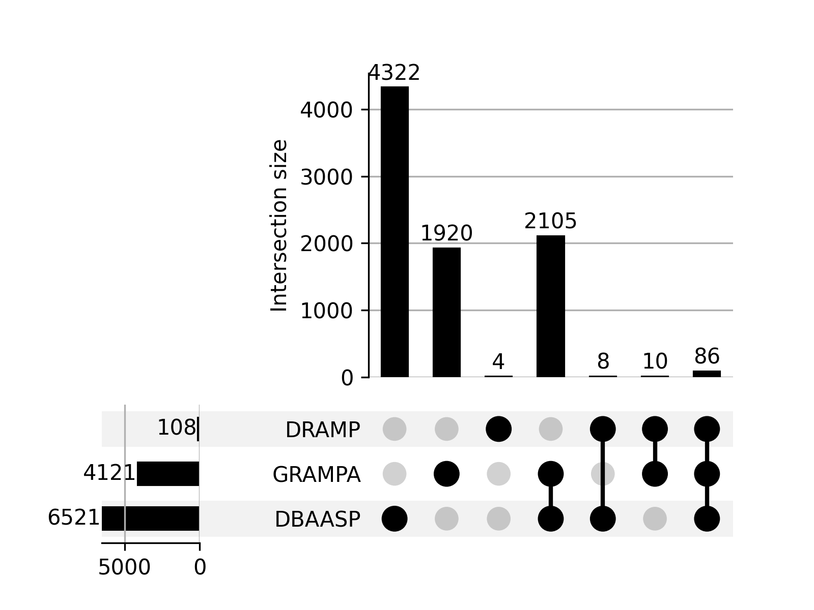

# AMP Challenge 2027 — data disclosure

> Hazra group submission entry.

---

## 1. Sources

No non-public data was used. All four sources are public. 

| source | obtained from | local path | dataset size |
|---|---|---|---|
| **DBAASP** | REST API, scraped by `scripts/dbaasp/01`–`04` | `data/raw-data/dbaasp/` | 25,069 peptides |
| **GRAMPA** | [zswitten/Antimicrobial-Peptides](https://github.com/zswitten/Antimicrobial-Peptides) — [`data/grampa.csv`](https://github.com/zswitten/Antimicrobial-Peptides/blob/master/data/grampa.csv) | `data/raw-data/grampa/grampa.csv` | 6760 peptides |
| **DRAMP** | <https://dramp.cpu-bioinfor.org/downloads/> | `data/raw-data/dramp/` | see below |
| **MarlysAMP** | [Mendeley 10.17632/w4hb5grjwb.3](https://data.mendeley.com/datasets/w4hb5grjwb/3) | `data/raw-data/marlys-amp/MLAMP_db.json` | 103,200 peptides |

The raw responses scraped from dbaasp are zipped and provided here:

- `data/raw-data/dbaasp/list_pages.zip` — every paginated `GET /peptides` response
- `data/raw-data/dbaasp/details.zip` — every `GET /peptides/{dbaaspId}` record

DBAASP dataframes (built by pipeline):

| step | file | rows |
|---|---|---|
|02| `dbaasp-peptides-compiled.csv` | 25,069 |
|04| `dbaasp-activity.csv` | 193,763 |
|04| `dbaasp-hc.csv` | 34,378 |

GRAMPA raw data can be downloaded using the following commands:
```bash
mkdir data/raw-data/grampa
wget https://raw.githubusercontent.com/zswitten/Antimicrobial-Peptides/refs/heads/master/data/grampa.csv -O data/raw-data/grampa/grampa.csv
```

DRAMP ships two files:

| file | rows |
|---|---|
| `Antibacterial_amps.txt` | 28,711 |
| `general_amps.txt` | 14,652 |

The raw DRAMP files are zipped and provided at: `data/raw-data/dramp.zip`.

Marlys AMP data can be downloaded like so:
```bash
mkdir data/raw-data/marlys-amp
wget https://data.mendeley.com/public-files/datasets/w4hb5grjwb/files/6c831932-8e0f-4441-9e53-33fae57da262/file_downloaded -O data/raw-data/marlys-amp/MLAMP_db.json
```
---

## 2. Data pipeline — stages 1 and 2

To be run in the following order from repo root. Every script is argparse-driven with explicit
`--` paths; add suitable arguments whenever necessary.

### 2.1 Scrape (DBAASP only)

```bash
python scripts/dbaasp/01-fetch-list-pages.py               # paginated peptides information
python scripts/dbaasp/02-build-peptides-csv.py             # builds dbaasp-peptides-compiled.csv (25,069)
python scripts/dbaasp/03-fetch-peptide-details.py          # fetch detailed peptide records
python scripts/dbaasp/04-build-peptide-activity-hc-df.py   # segregates peptides' data into two CSVs: activity (193,763) and hemolysis (34,378)
```

To reproduce the DBAASP dataframes used for training,
```bash
unzip /path/to/list_pages.zip                            # paginated peptides information
python scripts/dbaasp/02-build-peptides-csv.py           # combine and flatten peptide records
unzip /path/to/details.zip                               # fetch detailed peptide records
python scripts/dbaasp/04-build-peptide-activity-hc-df.py # segregates peptides' data into two CSVs: activity (193,763) and hemolysis (34,378)
```

### 2.2 Clean and combine

```bash
python scripts/clean_and_combine/prepare-finetune.py \
    --dbaasp ... --grampa ... --dramp ... --out data/processed-data/clean_and_combine/finetune.csv --fasta data/processed-data/clean_and_combine/finetune.fasta # finetune.csv (8,455 peptides)
```
Filters three data sources to keep: 
- monomer only
- 20 standard proteinogenic aa
- 8–50 aa
- no N/C-terminal modifications
- no intra-chain bonds (e.g. disulfide).

**Source DB of peptide sequences in finetune data**

<table>
<tr>
<td valign="top">

| Source DB | sequences |
|---|---|
| DBAASP | 6,521 |
| GRAMPA | 4,121 |
| DRAMP | 108 |

</td>
<td valign="top">



</td>
</tr>
</table>

Only 108 sequences from DRAMP passed the above-mentioned filters.

```bash
python scripts/clean_and_combine/prepare-pretrain.py \
    --marlys ... --out data/processed-data/clean_and_combine/pretrain.csv --fasta data/processed-data/clean_and_combine/pretrain.fasta # pretrain.csv (34,937 peptides)
```
Filters the MarLys AMP data dump for length and disulfide only — Marlys AMP has no modification
fields, so the terminal-modification filter cannot be applied. This is the larger set on which pre-training is carried out. `pretrain.csv` and `finetune.csv` have to be saved at the specified locations, since config YAML files use them.

### 2.3 Cluster and split

CD-HIT is run to cluster peptide sequences. Outputs are
saved under `data/processed-data/cluster_and_segregate/cd-hit-output/`.

```
CD-HIT version:  V4.8.1 (+OpenMP), Aug 20 2021, 08:39:56
finetune command: cd-hit -i finetune.fasta -o finetune50_output -c 0.5 -n 3 -l 5 -d 0 -M 0 -T 0        # out - finetune50_output.clstr   1,493 clusters
pretrain command: cd-hit -i pretrain.fasta -o pretrain50_output -c 0.5 -n 3 -l 5 -d 0 -M 0 -T 0        # out - pretrain50_output.clstr   6,363 clusters
```


```bash
python scripts/cluster_and_segregate/cdhit-split.py \
    --clstr data/processed-data/cluster_and_segregate/cd-hit-output/finetune50_output.clstr --reference /path/to/finetune.csv \
    --val-frac 0.05 --test-frac 0.05 --out data/processed-data/cluster_and_segregate/segregate/finetune_segregated.csv
```
Assigns the split at the cluster level, never splitting a cluster, using greedy bin-packing over cluster size and length bins (8–20 / 21–35 / 36–50 aa). Outputs 8,455 rows; train 7,609 / val 423 / test 423.

```bash
python scripts/cluster_and_segregate/filter-pretrain.py \
    --cluster .../pretrain50_output.clstr --pretrain .../pretrain.csv \
    --finetune data/processed-data/cluster_and_segregate/segregate/finetune_segregated.csv --out data/processed-data/cluster_and_segregate/segregate/pretrain_segregated.csv
```
Drops pretrain peptides whose cluster overlaps the finetune val/test splits.
Output: 28,121 peptides (from 34,937; 6,816 dropped).

Output paths for the segregated pretrain and finetune sets have to be at the specified locations since config YAML files use these locations.

### 2.4 Model inputs

```bash
python -m src.data.clean_corpus      # -> data/processed/*_clean.csv
python -m src.data.build_ld_labels   # -> data/ld-processed/*.csv
```

| output | rows | columns |
|---|---|---|
| `data/processed/finetune_clean.csv` | 8,455 (train 7,609 / val 423 / test 423) | `id, sequence, split` |
| `data/processed/pretrain_clean.csv` | 28,091 (30 duplicates dropped) | `id, sequence` |
| `data/ld-processed/finetuning.csv` | 8,455 | `sequence, charge, length, hydrophobic_moment, gravy` |
| `data/ld-processed/pretraining.csv` | 28,091 | `sequence, charge, length, hydrophobic_moment, gravy` |

- `clean_corpus` does a final check to ensure peptide sequences are valid according to competition conditions. Only change it made: 30 duplicates dropped from pretrain dataframe (28,121 -> 28,091).
- Both directories (`data/processed/` and `data/ld-processed/`) are gitignored and rebuilt by the two commands above.

---

## 3. MIC label pipeline — stage 3

Separate from the corpus pipeline, and the data behind the regressor for ranked top-100.

```bash
python scripts/dbaasp/05-standardize-mic.py     # default --medium MHB, data/processed-data/dbaasp-std/filtered-dbaasp.csv
```

From `dbaasp-activity.csv` (193,763 rows), filters for 
- monomer only
- measurement `MIC` only
- regex-based special character cleaning of `MIC` values
- µg/ml → µM via molecular weight 
- censoring recorded before bound removed
- target strains collapsed onto a species panel
- 20 standard proteinogenic aa
- 8–50 aa
- no N/C-terminal modifications
- no intra-chain bonds (e.g. disulfide)

Outputs `data/processed-data/dbaasp-std/filtered-dbaasp.csv`, with 2,344 unique sequences, all have medium MHB. Censored dataset: 2,660 right-censored peptides (MIC > mentioned concentration), 28 left-censored peptides (MIC < mentioned concentration).

```bash
python scripts/mic/01-build-mic-labels.py
```

Asserts the input is MHB-only, `y_pmic = 6 − log10(µM)` so higher is more potent. Censoring flips from MIC space into pMIC space due to sign change. Deduplication to one cell per (sequence, species), median of exact values or the weakest true bound, joins the cluster and split from the same CD-HIT run as stages 1–2, keeps the six best-supported species.

Output: `data/processed-data/mic-labels/mic_labels.csv`, 6,509 cells / 2,342 sequences.

**Splits**

| split | count |
|---|---|
| train | 2,099 |
| val | 133 |
| test | 110 |

**Train clusters**

|  | count |
|---|---|
| train clusters | 495 |

**Censoring (pMIC)**

| censoring | count |
|---|---|
| exact | 4,742 |
| left | 1,749 |
| right | 18 |

**Cells per species**

| species | cells |
|---|---|
| *E. coli* | 2,089 |
| *S. aureus* | 1,817 |
| *P. aeruginosa* | 1,223 |
| *K. pneumoniae* | 593 |
| *A. baumannii* | 432 |
| *E. faecalis* | 355 |

---

## 4. Data that was not used

| excluded | why |
|---|---|
| **GRAMPA MIC values** (51,345 rows) | No medium column exists, so they cannot be reconciled with an MHB-controlled target. GRAMPA contributes sequences only. |
| **Hemolysis data** (`dbaasp-hc.csv`, 34,378 rows / 12,801 peptides with concentration) | Unused. |
| **The 4 smallest species** (S. enterica ×2, E. faecium, E. cloacae) | Below ~300 sequences each, hence dropped. |

---

## 5. Reproducing

```bash
uv sync

# Corpus  (unzip the DBAASP archives first to reproduce)
python scripts/dbaasp/02-build-peptides-csv.py
python scripts/dbaasp/04-build-peptide-activity-hc-df.py
python scripts/clean_and_combine/prepare-finetune.py  --dbaasp ... --grampa ... --dramp ... --out ...
python scripts/clean_and_combine/prepare-pretrain.py  --marlys ... --out ...

# Cluster peptide sequences
python scripts/cluster_and_segregate/cdhit-split.py    --clstr ... --reference ... --out ...
python scripts/cluster_and_segregate/filter-pretrain.py --cluster ... --pretrain ... --finetune ... --out ...
python -m src.data.clean_corpus
python -m src.data.build_ld_labels

# MIC labels
python scripts/dbaasp/05-standardize-mic.py
python scripts/mic/01-build-mic-labels.py
python tests/test_censoring_sign.py # optional 
```
